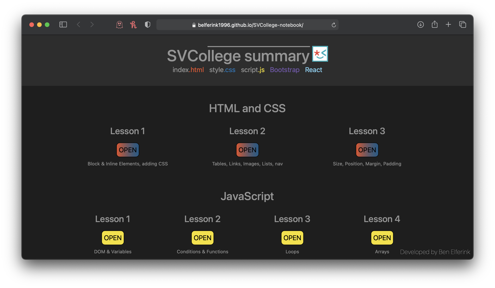

# SVCollege notebook

This project gives easy access to my vanilla-code lessons from Frontend bootcamp at
[SVCollege](https://svcollege.co.il/). 
The course covered the following topics: 

- HTML (fundementals)
- CSS (fundementals)
- Bootstrap (introduction)
- JavaScript
- React.js

To view all the files and code, you can use the
[Study Material](https://github.com/belferink1996/SVCollege-notebook/tree/main/Study%20Material)
directory.  [Access the notebook](https://benelferink.github.io/SVCollege-notebook/) to view the UI of all the files. 
**Note**! The notebook was created with vanilla code, the React.js lessons are _not supported_ in
the UI...

